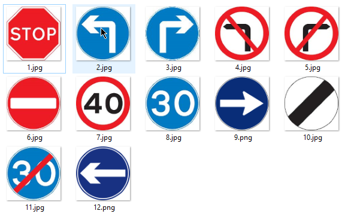

# Traffic_sign_Detection

  This project https://github.com/sruthi720/Traffic_sign_Detection is a traffic signs detection and classification system on videos using OpenCV. 
   Image Processing techniques  used here to detect the circles and ellipses on the video by the contures.
  
  #### REQUIREMENTS :
  
   1. Python 3.5
   2. OpenCV3
   3. Imutils (use -> pip3 install imutils  to install).
   
   #### FILES :
   
   It consist 3 python files which includes,
        and other files are svm file and README.
  
  #### DATASET :
  
  
   The Dataset folder contains images for training SVM models.It has 12 folders.
    
  
  #### RESULT :
  
 
  Result of the project is https://github.com/sruthi720/Traffic_sign_Detection/blob/master/demo.gif
  
   
 
   
   
